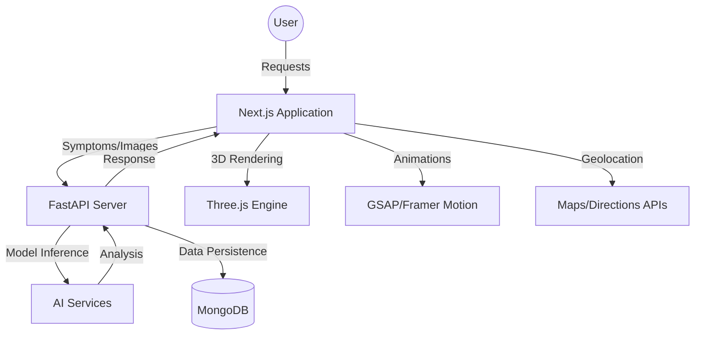

# AegisAI – Intelligent Emergency Health Assistant

[](https://aegisai.vercel.app)

## 🚀 Vision
In critical medical emergencies, every second counts. **AegisAI** is a high-performance, intelligent emergency health ecosystem designed to bridge the gap between symptom onset and professional medical intervention. By leveraging Multimodal AI, AegisAI provides instant risk assessment, life-saving first-aid guidance, and precise navigation to healthcare facilities through a premium, low-latency interface.

## ✨ Core Features (Hackathon Requirements)

### 1. 🧠 Machine Learning Disease Prediction
- **AI Symptom Analyzer**: Multimodal NLP engine leveraging Large Language Models for high-accuracy condition prediction and risk triage.
- **Computer Vision Injury Detection**: Instant wound severity analysis using advanced CNN-based image classification.
- **Risk Assessment Engine**: Scikit-learn based RandomForest model for categorical risk prediction (Critical, High, Moderate, Low).

### 2. 📊 Dataset Preprocessing & Training
- **Automated Training Pipeline**: Includes `backend/scripts/train_risk_model.py` for synthetic dataset generation and model training.
- **Data Preprocessing**: Scripts to handle medical terminology mapping and feature vectorization for the Risk Engine.

### 3. 📜 Prediction Interface & Dashboard
- **Medical Command Center**: A premium, unified dashboard summarizing clinical data, prediction results, and recommended first-aid actions.
- **Interactive Telemetry**: Real-time 3D Bio-Telemetry visualization (Three.js) for monitoring patient state during analysis.

### 4. ✅ Performance & Evaluation Metrics
- **System Audit Module**: Integrated `backend/scripts/audit_system.py` to evaluate model accuracy across multiple diagnostic scenarios.
- **Real-time Validation**: Logic-based cross-verification between ML predictions and clinical symptom extractions.

## 🚑 Additional Emergency Modules
- **📍 Smart Facility Locator**: Geolocation-based routing to hospitals and pharmacies.
- **🔔 SOS Broadcast**: One-tap emergency notification system with automated location sharing.

## 🏗️ System Architecture



## 🛠️ Tech Stack
- **Frontend**: Next.js 14, Tailwind CSS, **GSAP**, **Framer Motion**, **Three.js** (React Three Fiber), Web Speech API.
- **Backend**: **FastAPI**, Python, Pydantic, MongoDB.
- **AI/ML**: HuggingFace Transformers, PyTorch, Scikit-learn, CNN-based Image Analysis.
- **Deployment**: 
  - **Frontend**: [https://aegis-ai-1.onrender.com](https://aegis-ai-1.onrender.com) (Live)
  - **Backend**: [https://aegis-ai-b91n.onrender.com](https://aegis-ai-b91n.onrender.com) (Live)

## 🏁 Technical Setup

### 🔙 Backend (FastAPI)
1. **Navigate**: `cd backend`
2. **Environment**: Create a `.env` file with your `MONGODB_URI`.
3. **Install**: `pip install -r requirements.txt`
4. **Run**: `python main.py`
   - API: `http://localhost:8000`
   - Docs: `http://localhost:8000/docs`

### 🔜 Frontend (Next.js)
1. **Navigate**: `cd frontend`
2. **Install**: `npm install`
3. **Run**: `npm run dev`
   - Browse: `http://localhost:3000`

## 📂 Project Structure
```text
AegisAI/
├── frontend/             # Next.js Application
│   ├── src/app/          # Main application routes (Dashboard, Symptoms, Injuries)
│   ├── components/       # UI Components (Three.js Scences, Hero, Analyzers)
│   └── utils/            # Logic & API Clients
└── backend/              # FastAPI Application
    ├── api/              # Route handlers (Auth, Symptoms, User)
    ├── services/         # Business logic & AI model processing
    ├── models/           # Pydantic data schemas
    └── database/         # Persistence layer
```

---
*Developed for Hackathon. Built to save lives through Intelligent Health Telemetry.*
