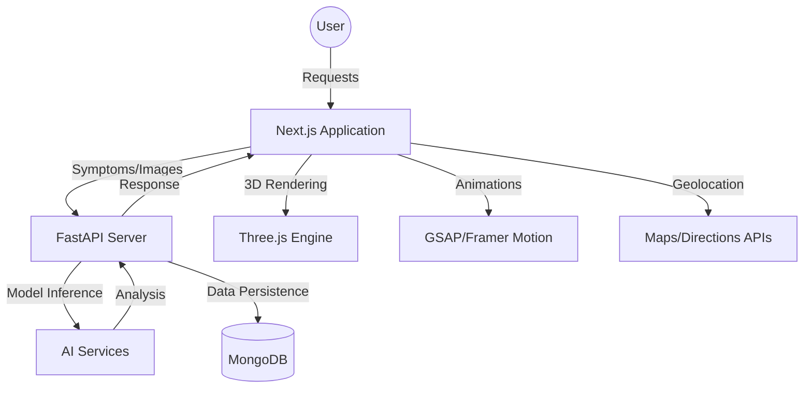

# AegisAI – Intelligent Emergency Health Assistant

[](https://aegisai.vercel.app)

## 🚀 Vision
In critical medical emergencies, every second counts. **AegisAI** is a high-performance, intelligent emergency health ecosystem designed to bridge the gap between symptom onset and professional medical intervention. By leveraging Multimodal AI, AegisAI provides instant risk assessment, life-saving first-aid guidance, and precise navigation to healthcare facilities through a premium, low-latency interface.

## ✨ Core Features
- **🧠 AI Symptom Analyzer**: Multimodal NLP engine (Text/Voice) for high-accuracy condition prediction and risk triage.
- **👁️ Computer Vision Injury Detection**: Instant wound severity analysis using advanced image classification.
- **🚑 Tactical First-Aid**: Real-time, step-by-step visual and spoken guidance for critical scenarios (Strokes, Choking, etc.).
- **📍 Smart Hospital & Pharmacy Locator**: Geolocation-based routing with real-time distance calculations and facility statuses.
- **🫀 3D Bio-Telemetry**: Interactive Three.js visualization for stable rhythm monitoring and health telemetry.
- **📜 Medical Command Center**: Unified dashboard summarizing clinical data, recommended actions, and emergency logs.
- **🔔 SOS Broadcast**: One-tap emergency notification system with automated telemetry and live location sharing.

## 🏗️ System Architecture



## 🛠️ Tech Stack
- **Frontend**: Next.js 14, Tailwind CSS, **GSAP**, **Framer Motion**, **Three.js** (React Three Fiber), Web Speech API.
- **Backend**: **FastAPI**, Python, Pydantic, MongoDB.
- **AI/ML**: HuggingFace Transformers, PyTorch, Scikit-learn, CNN-based Image Analysis.
- **Deployment**: Vercel (Frontend), Render/Local (Backend).

## 🏁 Technical Setup

### 🔙 Backend (FastAPI)
1. **Navigate**: `cd backend`
2. **Environment**: Create a `.env` file with your `MONGODB_URI`.
3. **Install**: `pip install -r requirements.txt`
4. **Run**: `python main.py`
   - API: `http://localhost:8000`
   - Docs: `http://localhost:8000/docs`

### 🔜 Frontend (Next.js)
1. **Navigate**: `cd frontend`
2. **Install**: `npm install`
3. **Run**: `npm run dev`
   - Browse: `http://localhost:3000`

## 📂 Project Structure
```text
AegisAI/
├── frontend/             # Next.js Application
│   ├── src/app/          # Main application routes (Dashboard, Symptoms, Injuries)
│   ├── components/       # UI Components (Three.js Scences, Hero, Analyzers)
│   └── utils/            # Logic & API Clients
└── backend/              # FastAPI Application
    ├── api/              # Route handlers (Auth, Symptoms, User)
    ├── services/         # Business logic & AI model processing
    ├── models/           # Pydantic data schemas
    └── database/         # Persistence layer
```

---
*Developed for AXIORA 2026. Built to save lives through Intelligent Health Telemetry.*
